# Swole CI/CD with GitHub Actions

Automated deployment pipeline using your `apollo-runners` self-hosted GitHub Actions runner.

## Workflows

### 🏗️ Backend Deployment (`deploy-backend.yml`)
**Triggers:**
- Push to `main` branch with changes in `swoleBackend/`
- Pull request to `main` with backend changes
- Manual trigger via GitHub UI

**What it does:**
1. ✅ Builds Docker image with commit SHA tag
2. ✅ Deploys to Kubernetes cluster on your home server
3. ✅ Waits for pods to be ready
4. ✅ Runs database seeding job
5. ✅ Tests health endpoint
6. ✅ Cleans up old Docker images
7. ✅ Provides deployment info (NodePort access)

### 📱 Frontend Build (`deploy-frontend.yml`)
**Triggers:**
- Push to `main` branch with changes in `swoleMobile/`
- Pull request to `main` with frontend changes  
- Manual trigger via GitHub UI

**What it does:**
1. ✅ Installs Node.js dependencies
2. ✅ Runs linting and type checking
3. ✅ Builds React Native app
4. ✅ Updates API configuration with K8s endpoint
5. ✅ Tests backend connectivity

## Setup Requirements

### 1. Apollo Runners Configuration
Your `apollo-runners` self-hosted runner needs:
- ✅ Docker installed and accessible
- ✅ `kubectl` configured to access your K8s cluster
- ✅ Node.js 20+ for frontend builds
- ✅ Network access to your Kubernetes cluster

### 2. Runner Permissions
The runner needs these capabilities:
```bash
# Docker operations
docker build, docker tag, docker rmi

# Kubernetes operations  
kubectl apply, kubectl get, kubectl wait, kubectl delete

# Node.js operations
npm ci, npm run build, npm run lint
```

### 3. Repository Setup
No secrets needed! Everything runs locally on your server.

## Deployment Flow

```mermaid
graph LR
    A[Push to main] --> B[Apollo Runner]
    B --> C[Build Docker Image]
    C --> D[Deploy to K8s]
    D --> E[Seed Database]
    E --> F[Health Check]
    F --> G[✅ Success]
    
    H[Frontend Push] --> I[Apollo Runner]
    I --> J[Build React Native]
    J --> K[Update API Config]
    K --> L[Test Connectivity]
    L --> M[✅ Ready]
```



## Monitoring

### Deployment Status
Check workflow status at:
```
https://github.com/matthewmyrick/swole/actions
```

### API Health
After deployment, check:
```bash
# Get the API endpoint
kubectl get svc swole-api-service -n swole

# Test health
curl http://YOUR-NODE-IP:30080/health
```

### Logs
View logs directly:
```bash
# API logs
kubectl logs -f deployment/swole-api -n swole

# Database logs  
kubectl logs -f statefulset/postgres -n swole

# Recent deployments
kubectl get pods -n swole
```

## Manual Operations

### Force Redeploy
```bash
# Trigger manual deployment
gh workflow run deploy-backend.yml

# Or use GitHub UI: Actions → Deploy Swole Backend → Run workflow
```

### Rollback
```bash
# Check deployment history
kubectl rollout history deployment/swole-api -n swole

# Rollback to previous version
kubectl rollout undo deployment/swole-api -n swole
```

### Clean Restart
```bash
# Restart API pods
kubectl rollout restart deployment/swole-api -n swole

# Restart PostgreSQL (careful!)
kubectl delete pod postgres-0 -n swole
```

## Troubleshooting

### Runner Issues
```bash
# Check runner status
sudo systemctl status actions.runner.apollo-runners

# Restart runner
sudo systemctl restart actions.runner.apollo-runners
```

### Build Failures
Common issues:
- **Docker build fails**: Check Dockerfile.api and dependencies
- **K8s apply fails**: Check kubectl connectivity and permissions  
- **Health check fails**: Check if pods are running and NodePort is accessible
- **Seed job fails**: Check PostgreSQL is ready and database schema

### Network Issues
```bash
# Test from runner to K8s
kubectl cluster-info

# Test NodePort access
curl http://localhost:30080/health
```

## Security

### What's Secure
✅ No secrets in GitHub - everything runs locally  
✅ Self-hosted runner on your network  
✅ Direct K8s cluster access (no external exposure)  
✅ Docker images stay local  

### Considerations
⚠️ Runner has full K8s cluster access  
⚠️ Basic database auth (fine for home lab)  
⚠️ No image registry - images stored locally  

Perfect for your home server setup! 🏠